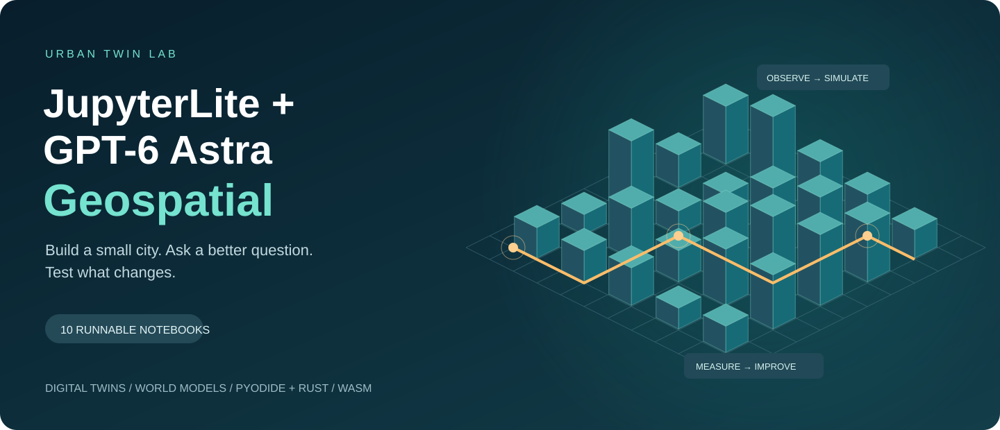

# JupyterLite + GPT-6 Astra Geospatial



**Sixteen geospatial teaching labs to run, inspect and extend in your browser.** Explore spatial reasoning, urban scenarios, raster change, equitable access, repeatable Astra evaluation, and interactive 3D mapping with MapLibre, deck.gl and Plotly.

## Live learning environments

| Experience | Live link |
|---|---|
| **JupyterBook: guided reading, code and example outputs** | [Open the JupyterBook](https://jltobias.github.io/JupyterLite-GPT-6-Astra-Geospatial/book/index.html) |
| **JupyterLite: edit and execute all sixteen notebooks** | [Open JupyterLite Lab](https://jltobias.github.io/JupyterLite-GPT-6-Astra-Geospatial/lite/lab/index.html) |
| JupyterLite entry page | [JupyterLite index.html](https://jltobias.github.io/JupyterLite-GPT-6-Astra-Geospatial/lite/index.html) |
| Experiment gallery | [Browse the labs and 3D scenes](https://jltobias.github.io/JupyterLite-GPT-6-Astra-Geospatial/index.html) |

The GitHub Actions workflow builds and publishes these paths. For a new fork, enable **Settings → Pages → Source: GitHub Actions** and run the workflow before using your fork's links.

Choose a notebook, select **Python (Pyodide)** if prompted, and choose **Run → Run All Cells**. First use downloads the runtime and packages. The baseline needs no accounts, API keys, external datasets or paid map tiles. Download edited notebooks and files in `exports/` to keep them; browser edits do not automatically sync to GitHub.

## The sixteen labs

| # | Notebook | What you can change and test | Run |
|---|---|---|---|
| 01 | [Spatial contracts](content/01_spatial_contracts.ipynb) | GeoJSON, coordinate order, units and feature IDs | [Launch](https://jltobias.github.io/JupyterLite-GPT-6-Astra-Geospatial/lite/lab/index.html?path=01_spatial_contracts.ipynb) |
| 02 | [Buildings and population](content/02_buildings_population.ipynb) | 3D massing, floor assumptions and population conservation | [Launch](https://jltobias.github.io/JupyterLite-GPT-6-Astra-Geospatial/lite/lab/index.html?path=02_buildings_population.ipynb) |
| 03 | [Network access](content/03_network_access.ipynb) | Walking barriers, travel time and clinic siting | [Launch](https://jltobias.github.io/JupyterLite-GPT-6-Astra-Geospatial/lite/lab/index.html?path=03_network_access.ipynb) |
| 04 | [Urban heat](content/04_heat_raster.ipynb) | Raster sampling and greening scenarios | [Launch](https://jltobias.github.io/JupyterLite-GPT-6-Astra-Geospatial/lite/lab/index.html?path=04_heat_raster.ipynb) |
| 05 | [Flood disruption](content/05_flood_disruption.ipynb) | Street closures and unreachable-population accounting | [Launch](https://jltobias.github.io/JupyterLite-GPT-6-Astra-Geospatial/lite/lab/index.html?path=05_flood_disruption.ipynb) |
| 06 | [Mobility and exposure](content/06_mobility_exposure.ipynb) | Agent activity, shared-setting events and ventilation | [Launch](https://jltobias.github.io/JupyterLite-GPT-6-Astra-Geospatial/lite/lab/index.html?path=06_mobility_exposure.ipynb) |
| 07 | [Sensor assimilation](content/07_sensor_assimilation.ipynb) | Missing readings, outliers and uncertainty | [Launch](https://jltobias.github.io/JupyterLite-GPT-6-Astra-Geospatial/lite/lab/index.html?path=07_sensor_assimilation.ipynb) |
| 08 | [A tiny world model](content/08_world_model.ipynb) | Learned dynamics, held-out trajectories and rollouts | [Launch](https://jltobias.github.io/JupyterLite-GPT-6-Astra-Geospatial/lite/lab/index.html?path=08_world_model.ipynb) |
| 09 | [Astra spatial evaluation](content/09_astra_spatial_eval.ipynb) | Map/prompt export, response import and computed scoring | [Launch](https://jltobias.github.io/JupyterLite-GPT-6-Astra-Geospatial/lite/lab/index.html?path=09_astra_spatial_eval.ipynb) |
| 10 | [Rust/WASM kernel](content/10_rust_wasm.ipynb) | Numerical parity and Python/NumPy/WASM timing | [Launch](https://jltobias.github.io/JupyterLite-GPT-6-Astra-Geospatial/lite/lab/index.html?path=10_rust_wasm.ipynb) |
| 11 | [Raster change](content/11_raster_change.ipynb) | Paired-valid pixels, cloud masks and observed change area | [Launch](https://jltobias.github.io/JupyterLite-GPT-6-Astra-Geospatial/lite/lab/index.html?path=11_raster_change.ipynb) |
| 12 | [Equitable siting](content/12_equitable_siting.ipynb) | Efficiency versus worst-group coverage and explicit objectives | [Launch](https://jltobias.github.io/JupyterLite-GPT-6-Astra-Geospatial/lite/lab/index.html?path=12_equitable_siting.ipynb) |
| 13 | [Spatial benchmark](content/13_spatial_benchmark.ipynb) | 30 seeded tasks, response import, per-family scoring and provenance | [Launch](https://jltobias.github.io/JupyterLite-GPT-6-Astra-Geospatial/lite/lab/index.html?path=13_spatial_benchmark.ipynb) |
| 14 | [MapLibre 3D](content/14_maplibre_3d.ipynb) | Geographic building extrusions, picking and height exaggeration | [Launch](https://jltobias.github.io/JupyterLite-GPT-6-Astra-Geospatial/lite/lab/index.html?path=14_maplibre_3d.ipynb) |
| 15 | [deck.gl layers](content/15_deckgl_layers.ipynb) | Buildings, streets, clinic scenarios and thematic population extrusion | [Launch](https://jltobias.github.io/JupyterLite-GPT-6-Astra-Geospatial/lite/lab/index.html?path=15_deckgl_layers.ipynb) |
| 16 | [3D terrain](content/16_terrain_3d.ipynb) | Plotly surface, water-level controls and vertical exaggeration | [Launch](https://jltobias.github.io/JupyterLite-GPT-6-Astra-Geospatial/lite/lab/index.html?path=16_terrain_3d.ipynb) |

Start with 01 → 02 → 03 for spatial foundations, 09 for model evaluation, and 08 → 10 for learned dynamics and compiled computation. See the [research guide](docs/GUIDE.md) for ideas and expansion paths.

For **3D mapping**, follow 14 → 15 → 16. Each exports an interactive HTML scene, static notebook plots and explicit units. Extensions add real OSM footprints with unknown heights preserved, timestamped synthetic trips, and a real terrain chip with a selectable cross-section. Scenes load pinned JavaScript renderers from CDNs and need WebGL; no basemap account, tile service or Python widget extension is required. Open a downloaded scene directly if notebook trust settings block the embedded view.

The [teaching guide](docs/TEACHING.md) provides workshop routes, copyable prompts, an assessment rubric and sharing instructions. All original notebooks now include a bounded Codex task and acceptance criteria. Labs 11–13 add response capture and scoring; default answers remain explicitly labeled fixtures.

## What “GPT-6 Astra geospatial” means here

Astra is a reasoning/coding collaborator and a model to evaluate. These notebooks do **not** execute a language model locally or make paid API calls. Each includes an Astra/Codex experiment. Notebook 09 includes a labeled fixture answer; replace it with an actual response to conduct a trial.

[OpenAI's model documentation](https://developers.openai.com/api/docs/models/gpt-6-astra), checked October 1, 2026, establishes general reasoning, coding, image input and structured output capabilities. It does not establish geospatial positional accuracy or valid urban forecasts. Verify geometry, routing, units and conservation with reproducible calculations. A convincing generated world is not a calibrated digital twin.

## Data sources and provenance

The baseline city, population, services and simulations are synthetic. Extended investigations also bundle three small public extracts near Gaborone: **125 OpenStreetMap footprints, a Sentinel-2 red/NIR/SCL chip, and a Mapzen terrain chip**. These are observational inputs, not validation of the invented population, clinics, exposure or forecasts. No census or patient records are included. See [data provenance and redistribution terms](content/data/README.md).

| Data / asset | Actual source | Scope and license |
|---|---|---|
| Buildings, floors and residential flags | Original [content/twin.py](content/twin.py) generator, seed 42 | Synthetic; MIT |
| Population | Invented total of 1,200, allocated by generated floor area | Synthetic; MIT; not census data |
| Streets, facilities, barriers, closures | Original regular grid and notebook equations | Synthetic; MIT; not OSM or real facilities |
| Heat, green cover and elevation | Original analytic raster equations | Synthetic; MIT; not satellite observations |
| Mobility and contact events | Original toy simulation, fixed seeds | Synthetic; MIT; no patients or calibrated TB parameters |
| Sensors | Seeded random walk, noise and inserted gaps/outlier | Synthetic; MIT; no real devices |
| World-model training/test data | Original two-state transition simulator | Synthetic; MIT; no pretrained weights |
| Evaluation map, prompt and fixture | Original coordinates and computed truth | MIT; fixture is not an Astra response |
| Raster-change grids and clouds | Original equations and fixed masks in lab 11 | Synthetic; MIT; not satellite imagery |
| Evaluation suite | Original seeded distance, routing and rectangle tasks in [experiments.py](content/experiments.py) | Synthetic; MIT; fixtures are not model performance |
| Baseline 3D scenes | Original building/network generators and analytic terrain | Synthetic; MIT |
| OSM extensions (01, 02, 14) | 125 closed building ways; IDs, versions and timestamps retained | ODbL 1.0; all reported numeric heights missing |
| Satellite extension (04) | Sentinel-2 L2A, 2025-01-23, 64 × 64 at 20 m | Modified Copernicus Sentinel data; added cloud patch is artificial |
| Terrain extension (16) | Mapzen Terrarium tile 14/9371/9351, 32 × 32 subsample | Upstream terrain terms; vertical datum not independently verified |
| Benchmark points and WASM | Original arithmetic sequence and [Rust source](rust/src/lib.rs) | Source MIT; toolchain support retains upstream licenses |
| Splash graphic | Original [SVG illustration](assets/geospatial-splash.svg) | MIT; no stock image, map tile, borrowed logo or raster generation |

External data retain their own terms, attribution and processing records in `content/data/`. Overture, census and facility registries are not bundled. Large-source preprocessing stays on the desktop; notebook learners use the small committed extracts without API credentials.

## Citations and attributions

1. **Tobias, James L.; Tolentino, Herman; Wuhib, Tadesse; and collaborators.** *Digital Twins: Botswana Kopanyo TB Study (2012–2016) for Gaborone TB simulation.* August 27, 2026. User-supplied 22-page presentation: `Gaborone-Digital-Twin-TB_Agent-Based-Modeling-8272026.pdf`. Context for spatial layers, access, event contracts and uncertainty. Not redistributed; no license grant inferred. These MVPs do not reproduce CHSP, Starsim or the private CDC pipeline.
2. **Tobias, James L.** *JupyterLite: Geospatial Data Science and Global Health.* July 10, 2026. User-supplied 47-page presentation: `Jim-Tobias-Peraton-JupyterLite-Geospatial-Data-Science-and-Global-Health-7102026.pdf`. Motivation for accessible browser learning. Not redistributed; rights remain with applicable rights holders.
3. **MagicCreator AI and credited creators.** [Awesome GPT-6 Astra Demos](https://github.com/magiccreator-ai/awesome-gpt-6-astra). Inspiration directory; no demo code, images, assets or benchmark claims copied. Individual projects retain their own licenses.
4. **Tobias, James L.** [JupyterLite Astra Demos](https://github.com/jltobias/JupyterLite-Astra-demos). Related educational project. New implementations were written for this repository.
5. **OpenAI.** [GPT-6 Astra model documentation](https://developers.openai.com/api/docs/models/gpt-6-astra). Capability reference, not geospatial validation or endorsement.
6. **Project Jupyter and JupyterLite contributors.** [JupyterLite deployment](https://jupyterlite.readthedocs.io/en/stable/quickstart/deploy.html) and [Pyodide kernel](https://github.com/jupyterlite/pyodide-kernel). Browser notebook infrastructure.
7. **Pyodide contributors.** [Package loading](https://pyodide.org/en/stable/usage/loading-packages.html). Browser Python and compatible scientific packages.
8. **Rust Project contributors.** [WASM target documentation](https://doc.rust-lang.org/stable/rustc/platform-support/wasm32-unknown-unknown.html). Compilation target for notebook 10.
9. **Ha, David, and Jürgen Schmidhuber.** (2018). *World Models.* [Project](https://worldmodels.github.io/), [arXiv:1803.10122](https://arxiv.org/abs/1803.10122). Conceptual inspiration; notebook 08 does not reproduce the neural architecture or results.
10. **Harris, C. R., et al.** (2020). *Array programming with NumPy.* Nature 585, 357–362. [doi:10.1038/s41586-020-2649-2](https://doi.org/10.1038/s41586-020-2649-2).
11. **Hunter, J. D.** (2007). *Matplotlib: A 2D Graphics Environment.* Computing in Science & Engineering 9(3), 90–95. [doi:10.1109/MCSE.2007.55](https://doi.org/10.1109/MCSE.2007.55).
12. **Executable Books Community.** [Jupyter Book](https://jupyterbook.org/) and [version 1 documentation](https://jupyter-book.readthedocs.io/v1/intro.html). This project pins the maintained 1.x/Sphinx publishing pipeline; MyST/Jupyter Book 2 migration is a future option.

Documentation references checked October 1, 2026. Presentations were background evidence, not executable instructions. Their research claims were not used as quantitative model parameters.

## Licensing

- Original code, notebooks, prose, synthetic fixtures and splash: **[MIT License](LICENSE)**. Preserve the copyright and license notice.
- Third-party software retains its own terms; see **[THIRD_PARTY_NOTICES.md](THIRD_PARTY_NOTICES.md)**. Runtime distributions have additional transitive notices; retain them when vendoring offline assets.
- Bundled external data, referenced PDFs, papers and external demos are not relicensed. A citation does not grant redistribution rights. The supplied PDFs are not uploaded here.
- Product names are descriptive. This independent educational project does not imply endorsement by OpenAI, Project Jupyter, Peraton or CDC.

## Build, validate and publish

See [the guide](docs/GUIDE.md#desktop-build) for environment setup and Rust compilation. After installing dependencies:

```sh
python -m pip install -r requirements-dev.txt
python scripts/test_core.py
python scripts/check_notebooks.py --require-wasm
python scripts/build_site.py
python -m pip install -r requirements-book.txt
python scripts/build_book.py
python -m playwright install chromium
python scripts/check_scenes.py
python scripts/browser_check.py
python -m http.server 8000 --directory _site
```

CI recompiles Rust, checks the calculations, builds both sites and runs the notebooks in a browser kernel before publishing. The book contains validation-run outputs; JupyterLite provides editable execution. [Validation notes](docs/VALIDATION.md) distinguish completed checks from unperformed model evaluations.

All sixteen notebooks now include an implemented extension, an input/method/evidence/limit concept map, spatial comparison graphics, an evidence-only Astra prompt export and a response-scoring cell. Model trials default to **NOT RUN**; computed fixtures are not model-performance results. The extension source lives in `scripts/extensions_*.py` and `scripts/notebook_extensions.py`.

**Extend with Codex:** change one assumption, retain a fixed baseline, add a meaningful invariant, edit the authoring source (`scripts/make_notebooks.py` and the teaching/mapping modules it imports), regenerate, and rerun the checks. The editable 3D templates are in `content/scene_templates/`. Never put an API secret in a notebook or static site.
